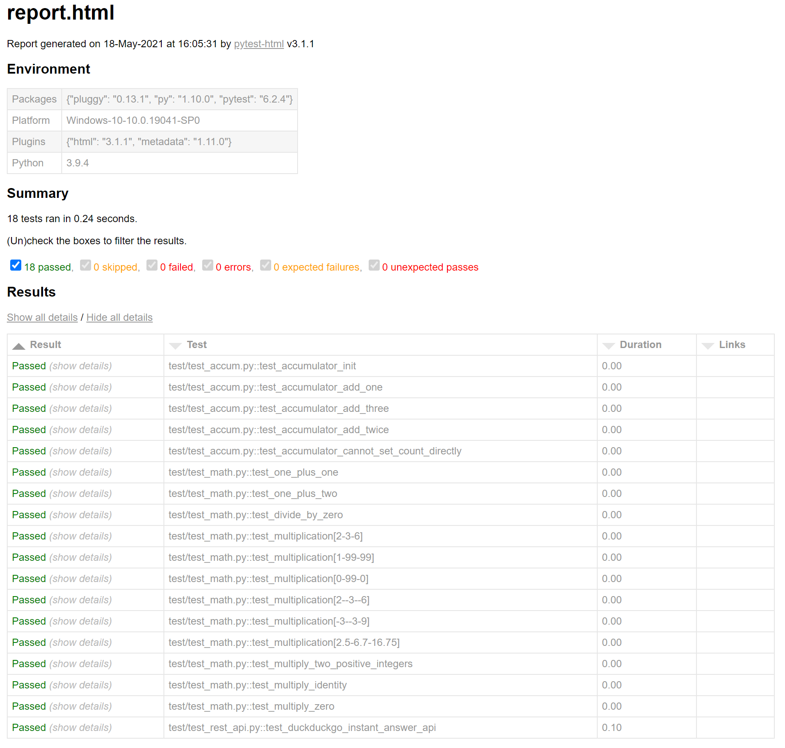

# python-pytest 

Help

Run

`python -m pytest --help`

Run after x limit test fails

Run

`python -m pytest --maxfail=2`

Generate XML report:

Run

`python -m pytest --junit-xml report.xml`

Run

Filtering tests: (only run test_accum.py)

`python -m pytest test/test_accum.py`

Individual test

Run

`python -m pytest test/test_math.py::test_one_plus_one`

Test that contains substring "one"

Run

`python -m pytest -k one`

Test that contains substring "one" and NOT "accum"

Run

`python -m pytest -k "one and not accum"`

Test with markers "math"

Run

`python -m pytest -m math`

HTML Report

`pip install pytest-html`

Run

`python -m pytest --html=report.html`

`

This will generate an HTML file

Report with coverage (plugin)

`pip install pytest-cov`

Run
`python -m pytest --cov=example_stuff`

Pytest-xdist (plugin) => To run test in parallel. (mult CPU)

`pip install pytest-xdist`

Run

`python -m pytest -n 3`

Pytest-bdd (plugin) => Write test cases in gherkin feature files
